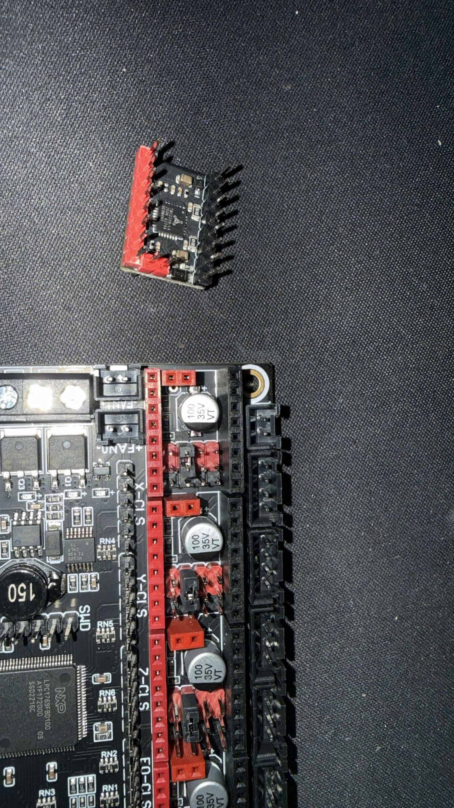
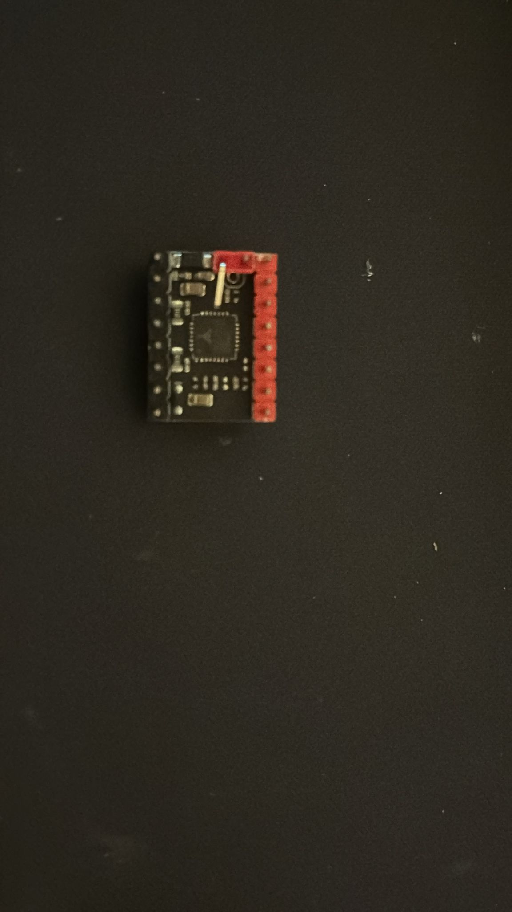

# Phase 1, Step 3: Orientación Drivers TMC2209

**Objetivo:** Documentar la orientación correcta de los drivers TMC2209 ANTES de insertarlos.

**Tiempo estimado:** 20-30 minutos

**⚠️ CRÍTICO:** Insertar un driver mal orientado lo destruye permanentemente.

---

## 📋 Material Necesario

- [ ] 5× drivers TMC2209 BigTreeTech (en bolsas antiestáticas)
- [ ] Pinzas de punta fina
- [ ] Lupa o buena iluminación
- [ ] Cámara / smartphone
- [ ] Alfombrilla antiestática (opcional pero recomendado)

---

## 📸 Fotos Obligatorias

- [ ] **Foto 1:** Zócalo X mostrando marca de orientación
- [ ] **Foto 2:** Driver TMC2209 mostrando marca/círculo PIN 1
- [ ] **Foto 3:** Driver colocado sobre zócalo (SIN insertar) con orientación correcta
- [ ] **Foto 4:** Vista de los 5 zócalos con marcas identificadas

**Guardar en:** `photos/phase1/03_driver_orientation_*.jpg`

---

## 📝 Procedimiento

### Paso 3.1: Identificar Marcas en Zócalos

En cada zócalo de driver, buscar la **marca de referencia**:
- Triángulo pequeño
- Esquina recortada
- Punto serigrafiado

Esta marca indica dónde debe ir el **PIN 1** del driver.

### Paso 3.2: Identificar Marca en Driver

1. Sacar **UN SOLO** driver de su bolsa antiestática
2. Observar el chip TMC2209 principal
3. Buscar un **círculo pequeño** o **punto** en una esquina
4. Esta es la marca del **PIN 1**

**Foto obligatoria:** Driver mostrando la marca claramente

### Paso 3.3: Verificar Orientación (SIN Insertar)

1. Colocar el driver **sobre** el zócalo (sin presionar)
2. Alinear la marca del driver con la marca del zócalo
3. Verificar visualmente que los pines se alinean con los orificios
4. **Foto obligatoria:** Driver en posición correcta SIN insertar
5. **Retirar el driver** y volver a guardarlo en bolsa antiestática

### Paso 3.4: Repetir Verificación

Repetir para al menos 2 drivers más para confirmar que entiendes la orientación.

---

## ✅ Validación

- [ ] Identificada marca en los 5 zócalos
- [ ] Identificada marca en al menos 1 driver
- [ ] Comprendido que marca driver = marca zócalo
- [ ] Fotos realizadas
- [ ] Drivers de vuelta en bolsas antiestáticas
- [ ] **NO has insertado drivers todavía**

---

## ⚠️ Errores Comunes

❌ **ERROR:** Insertar driver rotado 180°
✅ **CORRECTO:** Alinear marcas antes de insertar

❌ **ERROR:** Forzar driver sin verificar orientación
✅ **CORRECTO:** Verificar visualmente primero

---

## 🔧 PASO ADICIONAL: Doblar Pin DIAG

**¿Por qué doblar el pin DIAG?**

Para usar **endstops mecánicos** (en lugar de sensorless homing), debemos evitar que el pin DIAG interfiera con las señales de los endstops.

**Opciones:**
- ❌ Cortar el pin (irreversible)
- ✅ **Doblar el pin** (reversible, recomendado)

### Procedimiento para TODOS los 5 drivers:

**1. Quitar shroud plástico:**
- El driver tiene una cubierta plástica negra sobre los pines
- Tirar suavemente hacia arriba para removerla
- **Guardar el shroud** (lo repondremos después de insertar)

**2. Identificar pin DIAG:**
- Buscar la etiqueta "DIAG" en el PCB del driver
- Generalmente está en una esquina

**3. Doblar el pin:**
- Con pinzas de punta fina, sujetar el pin DIAG cerca de la base
- Doblar **hacia un lado** aproximadamente 90°
- El pin debe quedar paralelo al PCB
- **NO romper** el pin, solo doblarlo suavemente

**4. Verificar:**
- Pin doblado completamente hacia un lado
- No toca otros pines
- No está roto

**5. Repetir para los 5 drivers**

### Fotos de Referencia

**Driver con board (orientación):**

**Ejemplo pin DIAG:**

### Validación

Para cada driver:
- [ ] Shroud plástico removido (guardado)
- [ ] Pin DIAG identificado
- [ ] Pin DIAG doblado 90° hacia un lado
- [ ] Pin no roto, solo doblado
- [ ] No toca otros pines

**Total: 5 drivers con pin DIAG doblado**

---

## ➡️ Siguiente Paso

Una vez los 5 drivers tengan el pin DIAG doblado:

**[Step 4: Instalación Física Drivers](step4_driver_installation.md)**

---

**Estado:** ✅ Completado (2025-12-20)
**Drivers preparados:** 5× TMC2209 con pin DIAG doblado, orientación verificada
