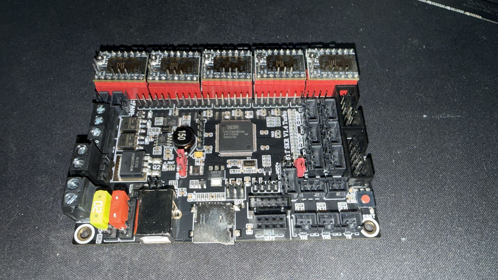

# Phase 1, Step 4: Instalación Física Drivers

**Objetivo:** Insertar los 5 drivers TMC2209 en sus zócalos.

**Tiempo estimado:** 20-30 minutos

---

## 📋 Material Necesario

- [ ] SKR 1.4 Turbo con jumpers UART (Steps 1-2)
- [ ] 5× drivers TMC2209
- [ ] Superficie antiestática
- [ ] Cámara / smartphone

---

## 📸 Fotos Obligatorias

- [ ] **Foto 1:** Proceso de inserción de primer driver (en ángulo, antes de presionar)
- [ ] **Foto 2:** Primer driver completamente insertado (acercamiento)
- [ ] **Foto 3:** Vista general con los 5 drivers instalados
- [ ] **Foto 4:** Acercamiento de cada driver instalado (5 fotos)

**Guardar en:** `photos/phase1/04_drivers_installed_*.jpg`

---

## 📝 Procedimiento

### Orden de Instalación Recomendado

Instalar en este orden (de más fácil a más difícil acceso):
1. E1
2. E0
3. Z
4. Y
5. X

### Para Cada Driver:

1. Sacar driver de bolsa antiestática
2. Identificar marca PIN 1
3. Alinear marca con marca del zócalo
4. **Verificar visualmente** que todos los pines se alinean
5. Colocar driver sin presionar todavía
6. Verificar que está horizontal (no ladeado)
7. **Presionar suavemente** con presión uniforme
8. El driver debe entrar sin forzar
9. Verificar que está completamente asentado
10. Verificar que ningún pin quedó fuera

**⚠️ Si no entra fácilmente: PARAR, verificar orientación**

---

## ✅ Validación

- [ ] 5 drivers instalados
- [ ] Todos con orientación correcta (marca alineada)
- [ ] Todos completamente asentados (no elevados)
- [ ] Ningún pin doblado o fuera del zócalo
- [ ] Fotos realizadas

---

## ⚠️ Troubleshooting

### El driver no entra

**NUNCA fuerces.** Pasos:
1. Retirarlo completamente
2. Verificar orientación
3. Verificar pines no doblados
4. Intentar de nuevo

---

## 🔧 PASO ADICIONAL: Instalación de Disipadores

**Si tu kit incluye disipadores de aluminio adhesivos:**

### Procedimiento (para cada driver):

1. **Limpiar superficie del chip TMC2209:**
   - Usar alcohol isopropílico y paño sin pelusa
   - Dejar secar completamente (1-2 minutos)

2. **Aplicar disipador:**
   - Retirar film protector del adhesivo térmico
   - Centrar disipador sobre el chip principal (el más grande)
   - Presionar firmemente 10-15 segundos
   - Verificar que está bien adherido

3. **Verificar:**
   - Disipador centrado sobre el chip
   - No toca componentes adyacentes
   - Bien adherido (no se mueve)

4. **Repetir para los 5 drivers**

### Validación

- [ ] 5 disipadores instalados
- [ ] Todos centrados sobre chips principales
- [ ] Bien adheridos
- [ ] No interfieren con componentes cercanos

**Tiempo de curado:** Esperar 10 minutos antes de manipular la placa.

---

## ➡️ Siguiente Paso

**[Step 5: Verificación Visual Final](step5_verification.md)**

---

## 📸 Fotos de Referencia

**Todos los drivers instalados:**

---

**Estado:** ✅ Completado (2025-12-20)
**Drivers instalados:** 5× TMC2209 (X, Y, Z, E0, E1) - Orientación correcta, DIAG pins doblados, disipadores instalados
