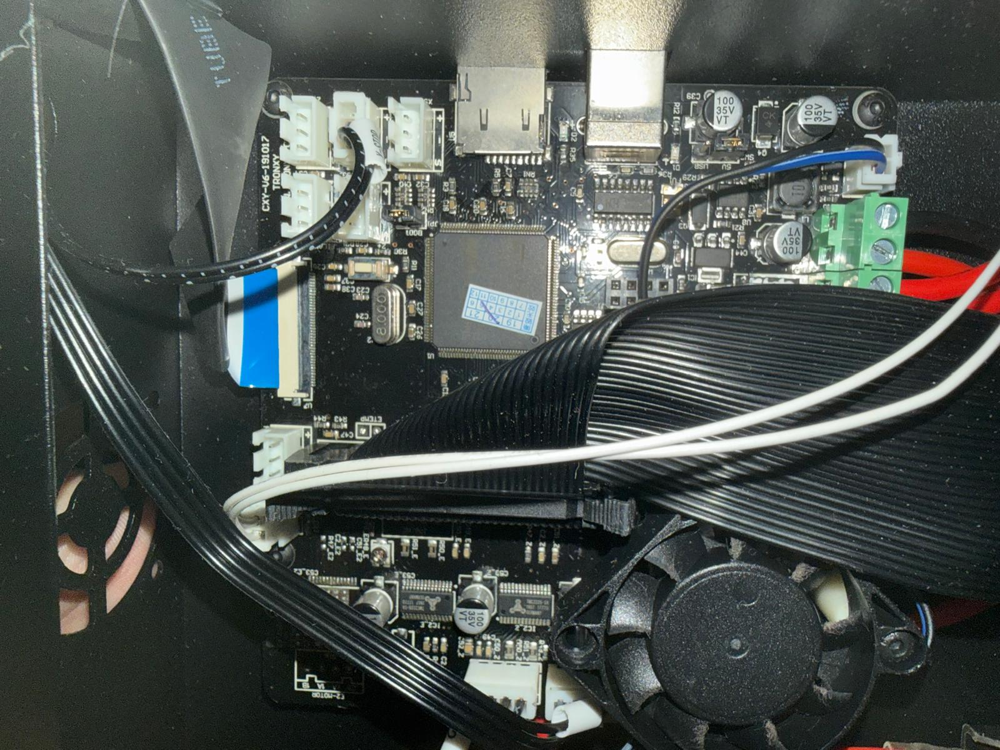

# Phase 0 — Baseline, Audit & Tooling

## Goal
Prepare a safe, reproducible environment before touching hardware.

No electronics were modified in this phase.

---

## What was done

### 1. Git & Repository setup
- Dedicated repository created
- Clean separation between:
  - Runtime (Klipper PC)
  - Development (Mac)
- Public GitHub repository

Rules:
- Mac → commits and pushes
- Klipper PC → pull only

---

### 2. Baseline Klipper configuration
- Stock `printer.cfg` copied and versioned
- Tagged as a permanent rollback point

Tag:
- `phase0-baseline`

---

### 3. Stock electronics audit
- Electronics photographed **without disconnecting anything**
- Purpose:
  - Identify connectors
  - Preserve wiring reference
  - Avoid guesswork during board swap

Photos:
### Stock control board — power and endstops

The following image documents the original electronics state **before any modification**.

Visible elements:
- Main control board (stock)
- Power input terminals
- Heated bed output
- Endstop connectors
- Z probe wiring

g`

---

### 4. Working rules defined
- No hardware changes without:
  - Photo
  - Commit
- No pushes from Klipper PC
- All documentation stored in-repo

---

## Result
- Printer confirmed electronically healthy
- Issues identified as firmware / configuration related
- Safe foundation ready for board migration

---

## Next phase
Phase 1: SKR 1.4 Turbo preparation (no installation yet)

