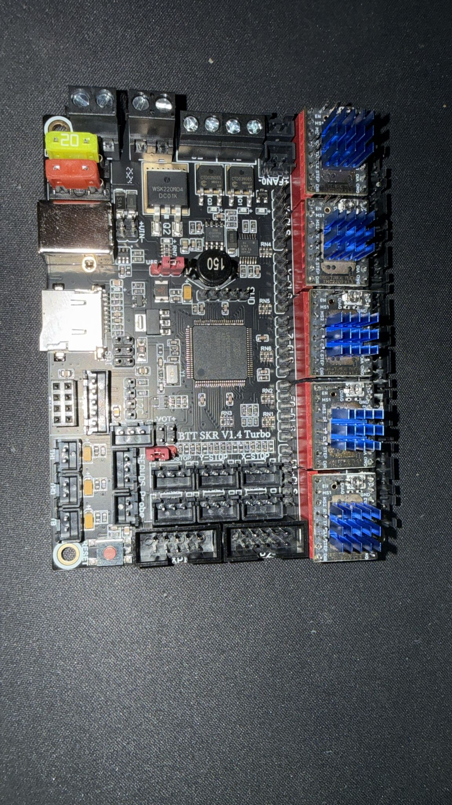

# 1.5 — Verificación visual final

**Fecha:** Pendiente
**Estado:** Pendiente

---

## Objetivo

Realizar una verificación visual completa de la placa antes de pasar a Phase 2 (cableado).

---

## Checklist de verificación

### Jumpers UART

- [ ] 10 jumpers en total (2 por eje)
- [ ] Cada eje (X, Y, Z, E0, E1) tiene jumpers en MS0 y MS1
- [ ] MS2 vacío en todos los ejes
- [ ] Ningún jumper ladeado o mal insertado

### Drivers TMC2209

- [ ] 5 drivers instalados (X, Y, Z, E0, E1)
- [ ] Todos con orientación correcta (marca PIN 1 alineada)
- [ ] Ningún pin doblado o fuera del zócalo
- [ ] Todos completamente asentados (no elevados)

### Estado general

- [ ] No hay componentes sueltos sobre la placa
- [ ] No hay residuos o suciedad
- [ ] No hay señales de daño físico
- [ ] Zócalos y conectores limpios

### Seguridad

- [ ] **Placa SIN alimentación**
- [ ] **Ningún cable conectado**
- [ ] Lista para guardar o pasar a Phase 2

---

## Foto final de Phase 1

**⚠️ PENDIENTE**

Esta foto debe mostrar:
- Los 5 drivers instalados
- Los 10 jumpers UART
- Vista general clara de toda la placa

---

## Comparación estado inicial vs final

### Estado inicial (1.1)
- SKR stock, sin drivers, sin jumpers

### Estado final (1.5)
- SKR con 5 drivers TMC2209 correctamente instalados
- 10 jumpers UART configurados
- Sin cables, sin alimentación
- Lista para Phase 2

---

## Documentación generada en Phase 1

- [x] Estado stock SKR documentado
- [x] Jumpers UART configurados y documentados
- [x] Orientación drivers documentada
- [x] Instalación física drivers documentada
- [x] Verificación visual final

---

## Siguiente fase

Una vez completada esta verificación:

➡️ **Phase 2: Cableado (motores, endstops, alimentación)**

---

## Punto de no retorno

Una vez inicies Phase 2 (cableado), será más complejo volver atrás.

**Asegúrate de que todo en Phase 1 está correcto antes de continuar.**

Si tienes dudas:
- Revisa las fotos de referencia
- Compara con la documentación
- Pregunta antes de avanzar

---

## Phase 1 — Completada ✓

Si todos los checkboxes están marcados y la foto final está hecha:

**Phase 1 está lista para cerrarse.**
